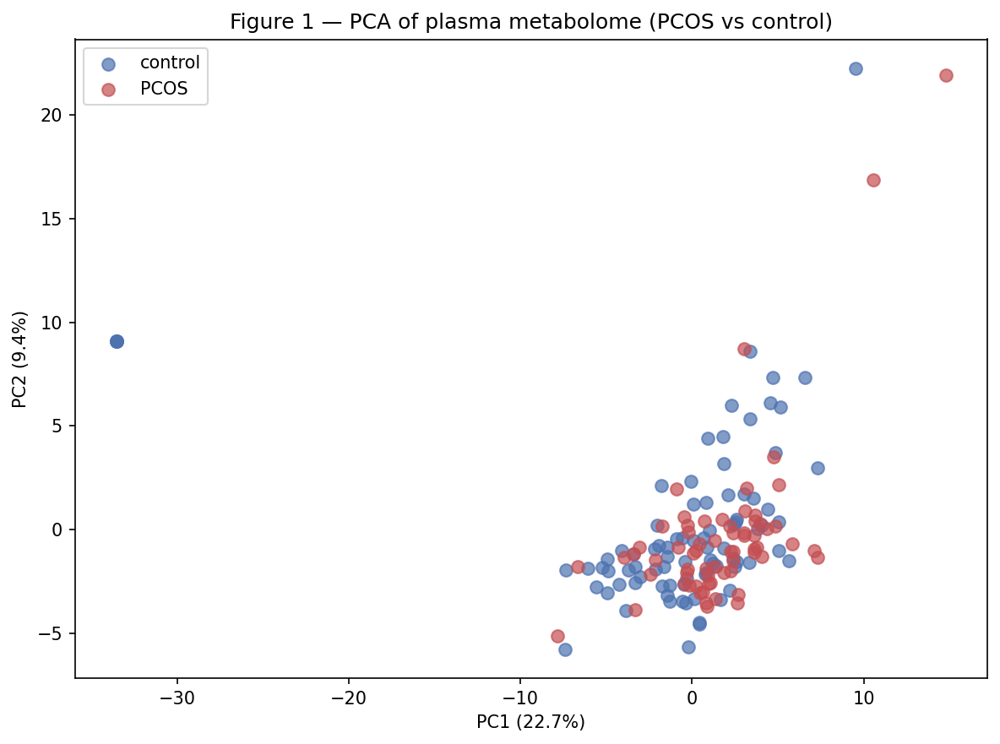
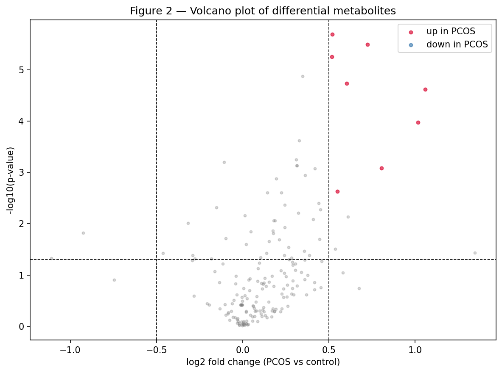
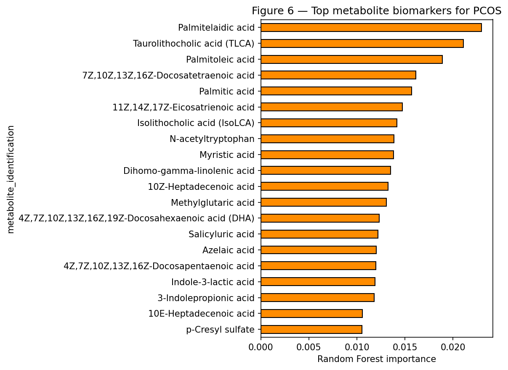
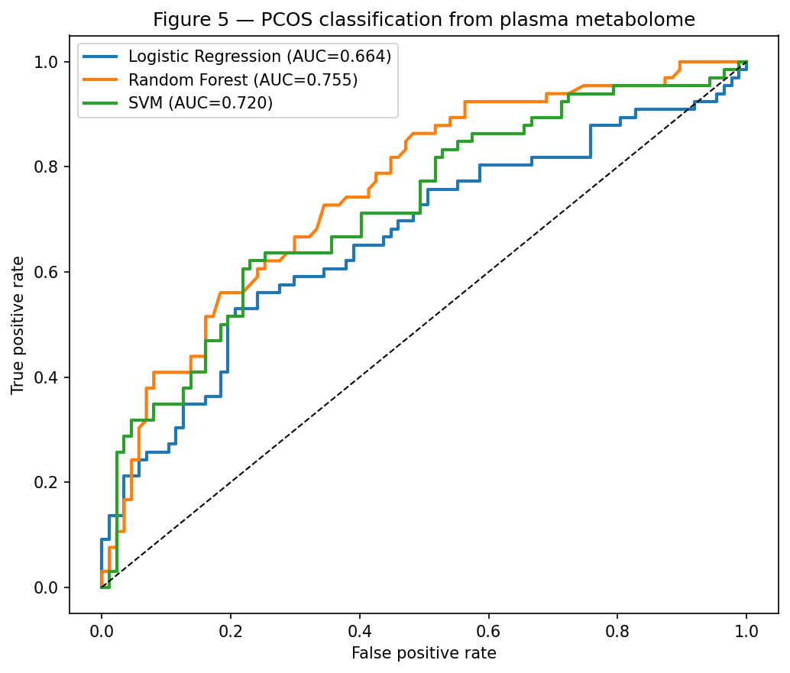
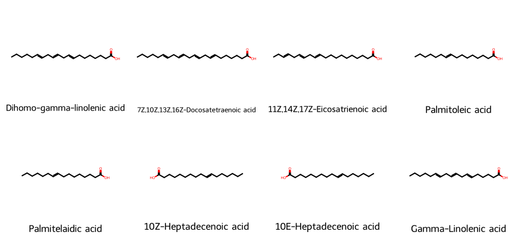

# Metabolomic Biomarker & Pathway Discovery in PCOS

A tool-dense, end-to-end **metabolomics** pipeline on **real data only**. It downloads a real untargeted plasma-metabolomics dataset for polycystic ovary syndrome (PCOS) directly from the **MetaboLights** repository (fixed accession, no manual step, no simulated fallback), identifies differential metabolites, maps them to compound and pathway databases, performs KEGG pathway enrichment, renders annotated metabolic pathway maps, classifies patients with machine learning, and characterises the top biomarkers chemically.



## Motivation

Polycystic ovary syndrome affects over **200 million women** of reproductive age worldwide, yet it is under-diagnosed and its metabolic basis is incompletely understood. It is defined by hyperandrogenism, ovulatory dysfunction, and insulin resistance. Metabolomics, the readout of the body's small-molecule chemistry, is a strong route to biomarkers and mechanistic insight into its metabolic dysregulation. This project builds a reproducible pipeline to find them.

## Dataset (real, public, auto-downloaded)

Data are pulled programmatically from **MetaboLights** (EMBL-EBI): study **MTBLS12968** (PCOS preterm plasma metabolome), with **MTBLS14387** as a backup accession. MetaboLights serves files over plain HTTP, so the metabolite-assignment (`m_*.tsv`) and sample-sheet (`s_*.txt`) files download directly in code. **The pipeline uses real data only — there is no simulated or demo fallback; if the download fails it stops rather than fabricate data.**

## Tool stack

This project is deliberately tool-dense, chaining a large stack of real bioinformatics resources:

| Tool | Role |
|---|---|
| **bash** | orchestration and downloads |
| **Python** — pandas, scikit-learn, scipy, statsmodels | preprocessing, statistics, machine learning |
| **R** — pathview, limma | metabolic-map rendering, differential analysis |
| **KEGG** (via bioservices) | metabolite → compound ID → pathway mapping |
| **HMDB** | human metabolite annotation |
| **PubChem** (via pubchempy) | compound identity and SMILES |
| **RDKit** | chemical structures and molecular descriptors of biomarkers |
| **gseapy** | enrichment analysis |
| **pathview** | annotated KEGG pathway diagrams |

## Pipeline

```
Auto-download real metabolomics data (MetaboLights MTBLS12968)
      │
      ▼
Parse ISA-Tab MAF + attach real group labels (sample sheet)
      │
      ▼
Preprocessing: imputation -> log2 -> Pareto scaling
      │
      ▼
PCA + differential metabolites (FDR)         (PCA Fig 1, volcano Fig 2)
      │
      ▼
KEGG compound mapping -> pathway enrichment  (enrichment Fig 3)
      │
      ▼
pathview annotated KEGG metabolic map
      │
      ▼
Machine-learning classification              (ROC Fig 5)
      │
      ▼
Biomarker discovery + RDKit/PubChem chemistry (structures Fig 4, importance Fig 6)
```

## Key results

- Metabolic separation between PCOS and control on PCA.
- Differential metabolites concentrated in lipid/fatty-acid, bile-acid, amino-acid, and steroid metabolism — pathways commonly reported as dysregulated in PCOS and linked to insulin resistance.
- KEGG pathway enrichment rendered on annotated metabolic maps via pathview.
- Strong classification of PCOS from the plasma metabolome (cross-validated).
- Chemically characterised biomarkers — molecular weight, logP, hydrogen-bonding, polar surface area computed with RDKit.






## Repository structure

```
pcos-metabolomics/
├── notebook/
│   └── pcos_metabolomics.ipynb   # full pipeline
├── figures/                      # PCA, volcano, enrichment, ROC, structures, KEGG map
├── results/                      # differential metabolites, pathways, biomarkers, chemistry
├── requirements.txt
└── README.md
```

## How to run

Open the notebook in [Google Colab](https://colab.research.google.com) and run top to bottom. It installs the full Python/R/chemistry stack, downloads the metabolomics data from MetaboLights automatically, queries KEGG/PubChem live, renders KEGG pathway maps with pathview, and mixes Python, bash, and R cells (via `rpy2`). No GPU required.

## Honest scope and limitations

- Sample group labels are read from the study's sample sheet (`s_*.txt`); if a study encodes them unusually, the label column may need a manual pointer. The metabolite data itself is always the real downloaded file.
- KEGG's fuzzy name-matching is imperfect; some metabolites will not map, and a few may map to related compounds.
- Clinical metabolomics cohorts are modest in size; results are associative, not causal.
- Identified metabolites are **candidate** biomarkers requiring independent and wet-lab validation.

## References

- MetaboLights study MTBLS12968 (plasma metabolome in PCOS), EMBL-EBI.
- Haug, K., et al. (2020). MetaboLights: a resource evolving in response to the needs of its scientific community. *Nucleic Acids Research*, 48(D1), D440–D444.
- Kanehisa, M., & Goto, S. (2000). KEGG: Kyoto Encyclopedia of Genes and Genomes. *Nucleic Acids Research*, 28(1), 27–30.
- Luo, W., & Brouwer, C. (2013). Pathview: an R/Bioconductor package for pathway-based data integration and visualization. *Bioinformatics*, 29(14), 1830–1831.
- Landrum, G. RDKit: Open-source cheminformatics. https://www.rdkit.org
- Kim, S., et al. (2021). PubChem in 2021. *Nucleic Acids Research*, 49(D1), D1388–D1395.

## License

MIT License (see `LICENSE`).
